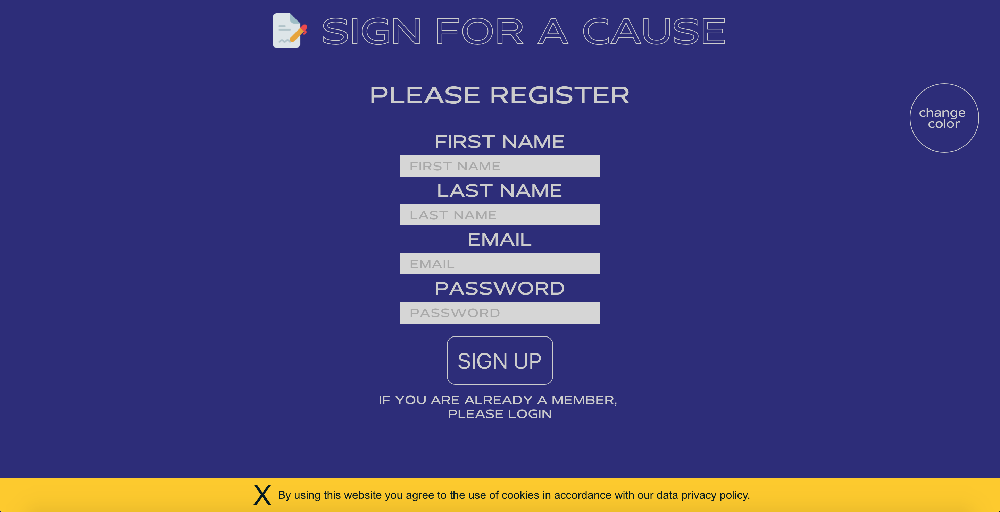
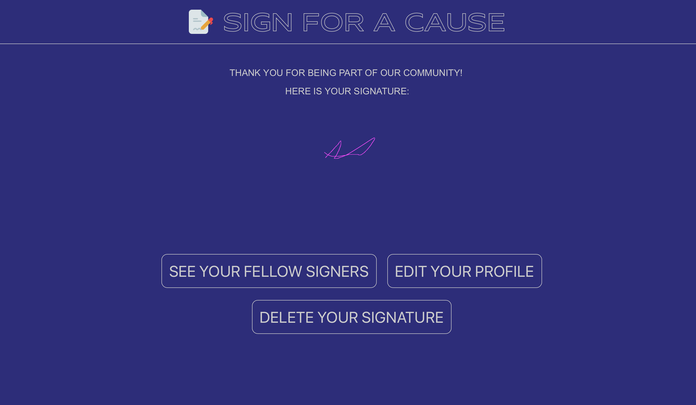

# sign-for-cause

In this app, users can register/login, create a profile, sign for a cause and discover the full list
of signers.  

The homepage features a customizable design where users can change its background color.

[visit live app](https://sign-for-cause.herokuapp.com/)

## Features

-   change background-color of homepage
-   login/register
-   create & update profile
-   sign (using canvas)
-   see list of signers
-   filter signers by city
-   delete signature
-   logout

## Tech

**Stack**: HTML, CSS, JavaScript, Node with Express.js, PostgreSQL  
**Protection**: CSURF  
**Testing**: SuperTest  
**Templating system**: Handlebars | **Deployment**: Heroku

## Visuals

